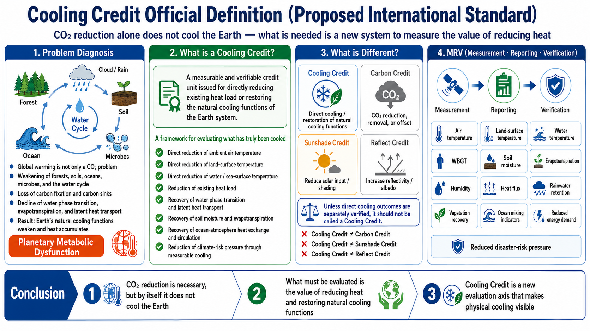

# Official Definition of Cooling Credits (Draft International Standard)

[English](README.md) | [日本語](README_ja.md) | [العربية](README_ar.md)



## Proposed International Definition and Classification Framework

A **Cooling Credit** is a verified credit unit representing measurable physical cooling or the restoration of natural cooling functions in the Earth system.

Cooling Credits must not be confused with Carbon Credits, Sunshade Credits, Reflect Credits, or general climate-adaptation credits.

The term **Cooling Credit** should be reserved only for interventions that directly reduce temperature, reduce existing heat load, or restore the natural processes that move, dissipate, transform, or buffer heat.

This document is a proposed international definition and classification framework. It is not presented as an already adopted ISO standard.

---

## 1. Short Definition

A **Cooling Credit** is a verified unit of physical cooling or natural cooling-function restoration.

It may be issued only when an intervention measurably reduces existing heat load, lowers ambient temperature, lowers land or water temperature, restores water-cycle cooling, enhances latent heat transport, recovers soil moisture, supports evapotranspiration, improves ocean-atmosphere heat exchange, or restarts natural cooling processes.

---

## 2. Formal Definition

A Cooling Credit is a measurable, verifiable, and attributable unit representing one or more of the following outcomes:

1. direct reduction of ambient air temperature;
2. direct reduction of land-surface temperature;
3. direct reduction of water or sea-surface temperature;
4. reduction of existing thermal load in a defined area or system;
5. restoration or supplementation of water phase transitions, including evaporation, condensation, cloud formation, precipitation support, freezing, melting, and latent heat transport;
6. restoration of soil moisture, vegetation evapotranspiration, or hydrological buffering;
7. restoration or support of ocean-atmosphere heat exchange and circulation;
8. reduction of climate-related risk pressure through measurable cooling or cooling-function recovery.

A Cooling Credit must be based on physical cooling or the recovery of natural heat-transport functions. It must not be based merely on emissions accounting, solar input reduction, albedo enhancement, or visual greening.

---

## 3. Planetary Metabolism Diagnosis

Global warming should be understood not only as a CO2-emissions problem, but as a failure of Earth’s metabolism.

Earth originally regulates heat through forests, soils, oceans, microorganisms, vegetation, evapotranspiration, clouds, rainfall, ocean circulation, carbon fixation, carbon absorption, and water phase transitions.

When these functions are lost or weakened, Earth loses part of its natural cooling capacity. Heat becomes trapped not only because additional greenhouse gases are emitted, but also because the living and hydrological systems that once absorbed carbon, moved water, transported latent heat, and cooled the surface have been degraded.

In this view, CO2 is both a cause and a symptom. CO2 emissions intensify warming, but the weakening of carbon sinks, carbon fixation sources, water cycles, soil moisture, forests, oceans, and natural cooling functions also amplifies CO2 accumulation and heat stress.

Diagnosing global warming only as a CO2-emissions problem is therefore incomplete. It is like seeing a human with a fever, observing that breathing and CO2 output have increased, and concluding that the treatment is simply to reduce breathing.

Reducing excessive emissions is necessary, just as stabilizing breathing may matter. But the deeper treatment is to restore the body’s metabolism, circulation, sweating, immunity, and temperature regulation.

For Earth, that means restoring forests, soils, oceans, microorganisms, carbon fixation, carbon absorption, water retention, evapotranspiration, water phase transitions, latent heat transport, and natural cooling functions.

CO2 reduction is necessary. But it is only one part of the treatment. It does not, by itself, restore Earth’s metabolism.

---

## 4. Core Principle

The core question of a Cooling Credit is:

```text
How much heat load, temperature stress, water-cycle disruption, soil moisture loss, or natural cooling-function decline was physically reduced?
```

This is different from a Carbon Credit, which asks:

```text
How much CO2 was reduced, removed, or offset?
```

A Cooling Credit is not an emissions-accounting instrument. It is a physical cooling and natural-system restoration instrument.

---

## 5. Strict Naming Boundary

The word **cooling** must be protected.

A project may be called a **Cooling Credit** only when its verified primary outcome is direct cooling or the restoration of natural cooling functions.

The following must not be called Cooling Credits by default:

- projects that mainly reduce incoming solar input;
- projects that mainly shade the Earth;
- projects that mainly increase reflectivity;
- projects that mainly whiten surfaces;
- projects that mainly change carbon accounts;
- projects that reduce vulnerability without measurable cooling;
- projects that cannot demonstrate physical cooling through MRV.

If these projects produce verified direct cooling outcomes, those outcomes may be evaluated separately. However, their primary classification must remain distinct.

---

## 6. Excluded Categories

### 6.1 Sunshade Credit

Interventions that primarily block, shade, or reduce incoming solar radiation should be classified as **Sunshade Credits**, not Cooling Credits.

Examples include stratospheric aerosol injection, orbital sunshades, space-based solar shields, and large-scale sunlight-reduction systems.

These methods may reduce incoming solar energy, but they do not necessarily restore water phase transitions, soil moisture, evapotranspiration, ocean circulation, or the dissipation of existing heat load.

### 6.2 Reflect Credit

Interventions that primarily increase surface reflectivity or albedo should be classified as **Reflect Credits**, not Cooling Credits.

Examples include ground reflectors, white-painted surfaces, reflective roofs, reflective pavements, reflective desert sheets, and mirror-based surface reflection systems.

These methods may reflect sunlight or reduce local heat absorption, but their primary mechanism is reflection, not direct cooling or restoration of natural cooling functions.

### 6.3 Carbon Credit

Carbon Credits must not be treated as Cooling Credits by default.

Carbon credits may reduce, remove, or offset greenhouse gas emissions. However, they do not necessarily demonstrate direct temperature reduction, existing heat-load reduction, water-cycle cooling recovery, soil moisture recovery, evapotranspiration recovery, ocean-atmosphere circulation recovery, or measurable reduction of heat stress.

Carbon Credits and Cooling Credits are separate categories.

---

## 7. Classification Rule

| Credit type | Primary mechanism | Can it be called Cooling Credit? |
|---|---|---|
| Cooling Credit | Direct temperature reduction or natural cooling-function restoration | Yes |
| Carbon Credit | CO2 reduction, removal, or offset | No, unless direct cooling outcomes are verified separately |
| Sunshade Credit | Reducing incoming sunlight | No |
| Reflect Credit | Increasing reflectivity or albedo | No, unless direct cooling outcomes are verified separately |
| Adaptation Credit | Reducing vulnerability or exposure | No, unless physical cooling is verified |
| Resilience Credit | Improving disaster preparedness | No, unless physical cooling is verified |

---

## 8. MRV Requirements

A Cooling Credit must be supported by Measurement, Reporting, and Verification.

Required indicators may include air temperature, land-surface temperature, water or sea-surface temperature, WBGT, soil moisture, evapotranspiration, humidity, heat flux, water retention, vegetation recovery, ocean mixing indicators, energy demand reduction caused by verified cooling, and disaster-risk pressure reduction linked to verified cooling.

---

## 9. Summary

A Cooling Credit is not a Carbon Credit.  
A Cooling Credit is not a Sunshade Credit.  
A Cooling Credit is not a Reflect Credit.

A Cooling Credit is a verified unit of physical cooling or natural cooling-function restoration.

Only interventions that directly reduce temperature, reduce existing heat load, or restore Earth’s natural cooling processes should be called Cooling Credits.

---

## Related Cooling Credit Repositories

This repository is part of the broader Cooling Credit knowledge system proposed by Master / inchacomusho / InchaComisho.

- [Cooling-Credit](https://github.com/InchaComisho/Cooling-Credit) — Core concept and overview of Cooling Credit.
- [Cooling-Credit-Definition](https://github.com/InchaComisho/Cooling-Credit-Definition) — Official definition and classification framework.
- [Cooling-Credit-Framework](https://github.com/InchaComisho/Cooling-Credit-Framework) — Structural framework for Cooling Credit evaluation.
- [Cooling-Credit-Implementation-Portfolio](https://github.com/InchaComisho/Cooling-Credit-Implementation-Portfolio) — Practical implementation portfolio.
- [Cooling-Credit-Implementation-and-Finance-Model](https://github.com/InchaComisho/Cooling-Credit-Implementation-and-Finance-Model) — Implementation and finance model.
- [Carbon-Credit-to-Cooling-Credit](https://github.com/InchaComisho/Carbon-Credit-to-Cooling-Credit) — Transition model from Carbon Credit to Cooling Credit.
- [carbon-credit-limitations-cooling-credit](https://github.com/InchaComisho/carbon-credit-limitations-cooling-credit) — Analysis of Carbon Credit limitations and the need for Cooling Credit.
- [Sustainable-Future-Cooling-Credit-Portal](https://github.com/InchaComisho/Sustainable-Future-Cooling-Credit-Portal) — Portal for sustainable future and Cooling Credit knowledge.
- [El-Nino-Warning-and-Cooling-Credit](https://github.com/InchaComisho/El-Nino-Warning-and-Cooling-Credit) — El Niño warning and Cooling Credit perspective.
- [Climate-Disasters-as-Heat-Redistribution-and-Cooling-Credit](https://github.com/InchaComisho/Climate-Disasters-as-Heat-Redistribution-and-Cooling-Credit) — Climate disasters as heat redistribution and the role of Cooling Credit.
## Author

Master / inchacomusho / InchaComisho

Independent Japanese concept designer, observer, proposer, AI tuner, and definer of Artificial Wisdom.  
Founder and advocate of the academic framework of Natural Complementary Science.  
Publicly active in natural-law philosophy, planetary circulation restoration, and co-creation with AI.

---

## Collaborative AI and Co-Creation Team

G (ChatGPT) / Mini (Gemini) / Cruz (Claude) / Real (Perplexity) / Lola (Dola) / Mana (Manus)

---

## Published / License

June 2026 / CC BY 4.0
