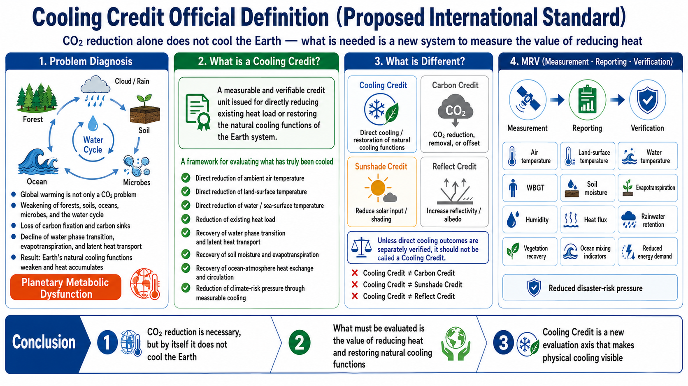

# Official Definition of Cooling Credits (Draft International Standard)

[English](README.md) | [日本語](README_ja.md) | [العربية](README_ar.md)



[](https://ko-fi.com/M6J122N2K2)

---

## Connection to Local Pilot Implementation

To connect this definition to schools, shopping streets, parks, farms, shelters, bus stops, and other small-scale measurable pilot sites, see the implementation model below.

- [Cooling-Credit-Local-Pilot-Model](https://github.com/InchaComisho/Cooling-Credit-Local-Pilot-Model/blob/main/README.md)

```text
Official Definition → Local Pilot → MRV Measurement → Local Cooling Points → Cooling Credit Institutionalization
```

---

## Proposed International Definition and Classification Framework

A **Cooling Credit** is a verified credit unit representing measurable physical cooling or the restoration of natural cooling functions in the Earth system.

Cooling Credits must not be confused with Carbon Credits, Sunshade Credits, Reflect Credits, or general climate-adaptation credits.

The term **Cooling Credit** should be reserved only for interventions that directly reduce temperature, reduce existing heat load, or restore the natural processes that move, dissipate, transform, or buffer heat.

This document is a proposed international definition and classification framework. It is not presented as an already adopted ISO standard.

---

## 1. Short Definition

A **Cooling Credit** is a verified unit of physical cooling or natural cooling-function restoration.

It may be issued only when an intervention measurably reduces existing heat load, lowers ambient temperature, lowers land or water temperature, restores water-cycle cooling, enhances latent heat transport, recovers soil moisture, supports evapotranspiration, improves ocean-atmosphere heat exchange, or restarts natural cooling processes.

---

## 2. Formal Definition

A Cooling Credit is a measurable, verifiable, and attributable unit representing one or more of the following outcomes:

1. direct reduction of ambient air temperature;
2. direct reduction of land-surface temperature;
3. direct reduction of water or sea-surface temperature;
4. reduction of existing thermal load in a defined area or system;
5. restoration or supplementation of water phase transitions, including evaporation, condensation, cloud formation, precipitation support, freezing, melting, and latent heat transport;
6. restoration of soil moisture, vegetation evapotranspiration, or hydrological buffering;
7. restoration or support of ocean-atmosphere heat exchange and circulation;
8. reduction of climate-related risk pressure through measurable cooling or cooling-function recovery.

A Cooling Credit must be based on physical cooling or the recovery of natural heat-transport functions. It must not be based merely on emissions accounting, solar input reduction, albedo enhancement, or visual greening.

---

## 3. Planetary Metabolism Diagnosis

Global warming should be understood not only as a CO2-emissions problem, but as a failure of Earth's metabolism.

Earth originally regulates heat through forests, soils, oceans, microorganisms, vegetation, evapotranspiration, clouds, rainfall, ocean circulation, carbon fixation, carbon absorption, and water phase transitions.

When these functions are lost or weakened, Earth loses part of its natural cooling capacity. Heat becomes trapped not only because additional greenhouse gases are emitted, but also because the living and hydrological systems that once absorbed carbon, moved water, transported latent heat, and cooled the surface have been degraded.

In this view, CO2 is both a cause and a symptom. CO2 emissions intensify warming, but the weakening of carbon sinks, carbon fixation sources, water cycles, soil moisture, forests, oceans, and natural cooling functions also amplifies CO2 accumulation and heat stress.

Diagnosing global warming only as a CO2-emissions problem is therefore incomplete. It is like seeing a human with a fever, observing that breathing and CO2 output have increased, and concluding that the treatment is simply to reduce breathing.

Reducing excessive emissions is necessary, just as stabilizing breathing may matter. But the deeper treatment is to restore the body's metabolism, circulation, sweating, immunity, and temperature regulation.

For Earth, that means restoring forests, soils, oceans, microorganisms, carbon fixation, carbon absorption, water retention, evapotranspiration, water phase transitions, latent heat transport, and natural cooling functions.

CO2 reduction is necessary. But it is only one part of the treatment. It does not, by itself, restore Earth's metabolism.

---

## 4. Core Principle

The core question of a Cooling Credit is:

```text
How much heat load, temperature stress, water-cycle disruption, soil moisture loss, or natural cooling-function decline was physically reduced?
```

This is different from a Carbon Credit, which asks:

```text
How much CO2 was reduced, removed, or offset?
```

A Cooling Credit is not an emissions-accounting instrument. It is a physical cooling and natural-system restoration instrument.
