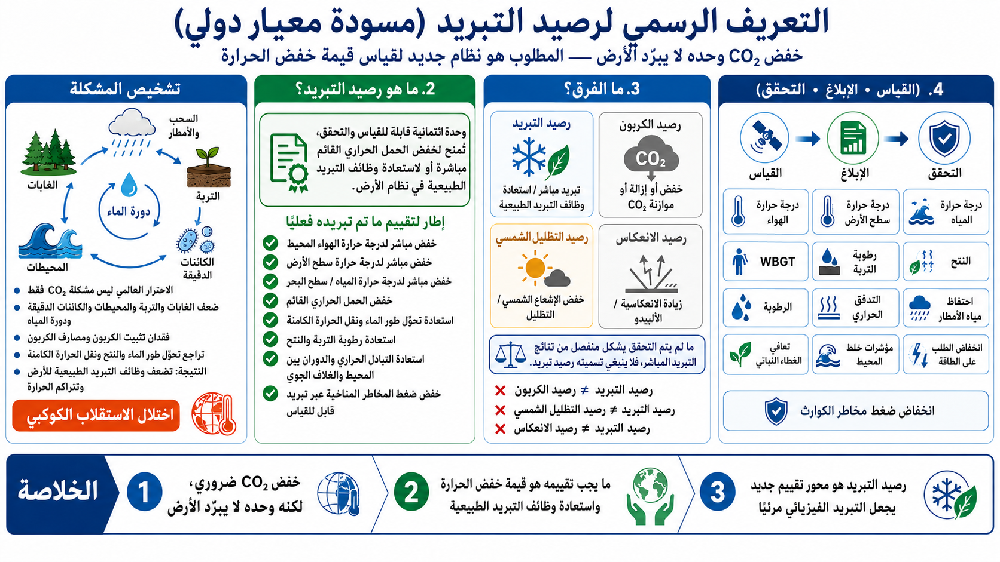

# التعريف الرسمي لمكافأة التبريد (مسودة معيار دولي)

[English](README.md) | [日本語](README_ja.md) | [العربية](README_ar.md)



---

## الاتصال بالتجارب المحلية الصغيرة

لربط هذا التعريف بالمدارس، والشوارع التجارية، والحدائق، والمزارع، والملاجئ، ومواقف الحافلات، وغيرها من مواقع التجربة المحلية القابلة للقياس، راجع نموذج التنفيذ التالي.

- [Cooling-Credit-Local-Pilot-Model](https://github.com/InchaComisho/Cooling-Credit-Local-Pilot-Model/blob/main/README_ar.md)

```text
التعريف الرسمي → تجربة محلية → قياس MRV → نقاط تبريد محلية → مأسسة أرصدة التبريد
```

---

## إطار تعريف وتصنيف مقترح بمستوى معيار دولي

أرصدة التبريد هي وحدات ائتمانية قابلة للقياس والتحقق، تُمنح للمساهمات التي تخفّض الحمل الحراري القائم مباشرة، أو تستعيد وظائف التبريد الطبيعية داخل نظام الأرض.

يجب عدم الخلط بين أرصدة التبريد وأرصدة الكربون، أو أرصدة التظليل الشمسي، أو أرصدة الانعكاس، أو أرصدة الهندسة الشمسية، أو أرصدة التكيف المناخي العامة.

ينبغي حصر مصطلح أرصدة التبريد في التدخلات التي تخفض درجة الحرارة مباشرة، أو تخفض الحمل الحراري القائم، أو تستعيد العمليات الطبيعية التي تنقل الحرارة أو تبددها أو تحولها أو تخزنها مؤقتًا.

هذا المستند هو إطار تعريف وتصنيف مقترح، وليس معيارًا رسميًا معتمدًا بالفعل.

---

## 1. تعريف مختصر

رصيد التبريد هو وحدة موثقة للتبريد الفيزيائي أو لاستعادة وظائف التبريد الطبيعية.

ولا يجوز إصداره إلا عندما يثبت التدخل، بصورة قابلة للقياس، أنه يخفض الحمل الحراري القائم، أو يخفض درجة الحرارة المحيطة، أو يخفض درجة حرارة اليابسة أو المياه، أو يستعيد تبريد دورة المياه، أو يعزز نقل الحرارة الكامنة، أو يستعيد رطوبة التربة، أو يدعم النتح، أو يحسن تبادل الحرارة بين المحيط والغلاف الجوي، أو يعيد تشغيل عمليات التبريد الطبيعية.

---

## 2. التعريف الرسمي

رصيد التبريد هو وحدة قابلة للقياس والتحقق والإسناد، تمثل واحدًا أو أكثر من النتائج التالية:

1. خفض مباشر لدرجة حرارة الهواء المحيط؛
2. خفض مباشر لدرجة حرارة سطح اليابسة؛
3. خفض مباشر لدرجة حرارة المياه أو سطح البحر؛
4. خفض الحمل الحراري القائم في منطقة أو نظام محدد؛
5. استعادة أو دعم تحولات طور الماء، بما في ذلك التبخر، والتكاثف، وتكوّن السحب، ودعم الهطول، والتجمد، والذوبان، ونقل الحرارة الكامنة؛
6. استعادة رطوبة التربة، أو نتح الغطاء النباتي، أو الوظائف الهيدرولوجية العازلة؛
7. استعادة أو دعم تبادل الحرارة والدوران بين المحيط والغلاف الجوي؛
8. خفض ضغط المخاطر المرتبطة بالمناخ من خلال تبريد قابل للقياس أو استعادة وظائف التبريد.

يجب أن يستند رصيد التبريد إلى تبريد فيزيائي أو إلى استعادة وظائف نقل الحرارة الطبيعية. ولا يجوز أن يستند فقط إلى محاسبة الانبعاثات، أو تقليل الإشعاع الشمسي الداخل، أو زيادة الألبيدو، أو التخضير الشكلي.

---

## تشخيص الاحترار العالمي بوصفه اختلالًا في الاستقلاب الكوكبي

ينبغي فهم الاحترار العالمي ليس بوصفه مشكلة انبعاثات CO₂ وحدها، بل بوصفه اختلالًا أوسع في الاستقلاب الكوكبي ووظائف التنظيم الحراري الطبيعية للأرض.

فالأرض لا تنظّم حرارتها من خلال الغلاف الجوي وحده.
إنها تعتمد أيضًا على الغابات، والتربة، والمحيطات، والكائنات الدقيقة، والغطاء النباتي، والنتح، والسحب، والأمطار، والتيارات البحرية، وتثبيت الكربون، وامتصاص الكربون، وتحولات طور الماء.

وعندما تضعف هذه الوظائف أو تُفقد، تفقد الأرض جزءًا من قدرتها الطبيعية على التبريد.
ولا تتراكم الحرارة فقط بسبب زيادة غازات الدفيئة، بل أيضًا بسبب تدهور الأنظمة الحية والمائية التي كانت تمتص الكربون، وتحفظ الرطوبة، وتنقل الماء، وتحمل الحرارة الكامنة، وتبرّد السطح.

من هذا المنظور، فإن CO₂ ليس سببًا منفردًا فقط، بل هو أيضًا عَرَض يتضخم نتيجة ضعف مصارف الكربون، ومصادر تثبيت الكربون، ودورة المياه، ورطوبة التربة، والغابات، والمحيطات، ووظائف التبريد الطبيعية.

لذلك، فإن تشخيص الاحترار العالمي على أنه مشكلة انبعاثات CO₂ فقط هو تشخيص غير مكتمل.

ويمكن تشبيه ذلك بإنسان أصيب بالحمّى، فزادت سرعة تنفسه وازداد إخراج CO₂ من جسمه، ثم قيل إن العلاج هو تقليل التنفس فقط.
تنظيم التنفس قد يكون ضروريًا، لكنه لا يعالج سبب الحمى. العلاج الأعمق هو استعادة توازن الجسم، والدورة الدموية، والتعرق، والمناعة، ووظائف تنظيم الحرارة.

والأمر نفسه ينطبق على الأرض.
فخفض انبعاثات CO₂ ضروري، لكنه ليس كافيًا وحده.
ما يجب استعادته هو الغابات، والتربة، والمحيطات، والكائنات الدقيقة، وتثبيت الكربون، وامتصاص الكربون، واحتفاظ المياه، والنتح، وتحولات طور الماء، ونقل الحرارة الكامنة، ووظائف التبريد الطبيعية.

إن خفض CO₂ جزء من العلاج، لكنه لا يعيد بمفرده الاستقلاب الكوكبي ولا يستعيد وظائف التبريد الطبيعية للأرض.

---

## 3. المبدأ الأساسي

السؤال المركزي لرصيد التبريد هو:

كم تم تقليله فعليًا من الحمل الحراري، والإجهاد الحراري، واضطراب دورة المياه، وفقدان رطوبة التربة، وتراجع وظائف التبريد الطبيعية؟

وهذا يختلف عن السؤال الذي تطرحه أرصدة الكربون:

كم تم خفضه أو إزالته أو تعويضه من CO₂؟

أرصدة التبريد ليست أداة لمحاسبة الانبعاثات فقط.
إنها أداة للتبريد الفيزيائي واستعادة الأنظمة الطبيعية.
