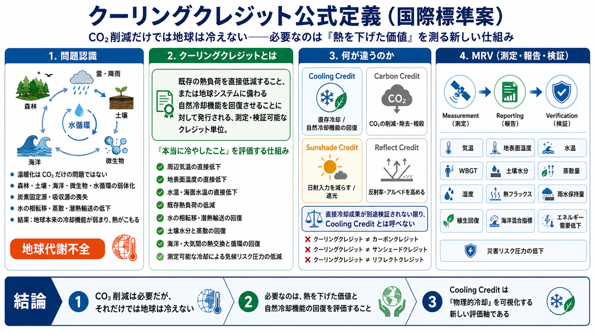

# クーリングクレジット公式定義（国際標準案）

[English](README.md) | [日本語](README_ja.md) | [العربية](README_ar.md)



## 国際標準案としての定義・分類フレームワーク

**クーリングクレジット**とは、既存の熱負荷を直接低減すること、または地球システムに備わる自然冷却機能を回復させることに対して発行される、測定・検証可能なクレジット単位である。

この名称は、気温を直接下げる取り組み、または水の相転移、潜熱輸送、蒸散、土壌水分、海洋・大気熱交換などの自然冷却機能を補完・回復・再起動する取り組みに限定して用いるべきである。

本書は国際標準案としての定義文であり、既に採択された公的標準ではない。

---

## 1. 公式定義

クーリングクレジットは、次のいずれかを測定・報告・検証できる場合にのみ成立する。

1. 周辺気温の直接低下
2. 地表面温度の直接低下
3. 水温または海面水温の直接低下
4. 既存熱負荷の低減
5. 水の相転移と潜熱輸送の回復
6. 土壌水分と蒸散の回復
7. 海洋・大気間の熱交換と循環の回復
8. 測定可能な冷却による気候関連リスク圧力の低減

クーリングクレジットは、排出量会計、日射低減、アルベド上昇、見た目だけの緑化ではなく、物理的冷却、または自然の熱輸送機能の回復に基づかなければならない。

---

## 2. 地球代謝不全としての温暖化診断

温暖化とは、CO₂排出だけの問題ではなく、地球の代謝不全として捉える必要がある。

地球は本来、森林、土壌、海洋、微生物、植生、蒸散、雲、降雨、海流、炭素固定、炭素吸収、水の相転移によって熱を調整している。

しかし、人類は森林を減らし、土壌を壊し、海を弱らせ、水循環と水の相転移を失わせ、炭素固定源・炭素吸収源・自然冷却機能を弱体化させてきた。

その結果、地球は本来の冷却機能を失い、熱を逃がしにくくなった。CO₂排出はその熱のこもりをさらに強める。

したがってCO₂は原因の一部であると同時に、地球代謝崩壊の結果として増幅される症状でもある。

温暖化をCO₂排出だけの問題と診断するのは不完全である。人間で言えば、風邪や感染症で熱が出て呼吸が荒くなっている状態に対し、「呼吸でCO₂が多く出ている。だから呼吸を減らしましょう」と言っているようなものである。

呼吸を整えることは必要かもしれない。しかし、それだけでは発熱の原因は治らない。必要なのは、免疫、血流、発汗、代謝、体温調節機能そのものを回復させることである。

地球でも同じである。必要なのは、森林、土壌、海洋、微生物、炭素固定、炭素吸収、水循環、保水、蒸散、水の相転移、潜熱輸送、自然冷却機能を回復させることである。

CO₂排出削減は必要である。しかし、それは治療の一部であって、地球の代謝そのものを回復する処置ではない。

---

## 3. 基本原則

クーリングクレジットが問うのは、次である。

```text
どれだけ熱負荷、温度ストレス、水循環の乱れ、土壌水分の喪失、自然冷却機能の低下を物理的に減らしたか。
```

カーボンクレジットが問うのは、次である。

```text
どれだけCO₂を削減・除去・相殺したか。
```

この二つは別分類である。

---

## 4. 名称保護条項

**クーリングクレジット**という名称は、気温を直接下げる、既存熱負荷を下げる、または自然冷却機能を回復するプロジェクトに限定すべきである。

**冷却・遮光・日陰・反射・アルベド・熱入力抑制**の詳細な境界については、[冷却名称境界定義](docs/COOLING_NAMING_BOUNDARY_ja.md) を参照する。

主に太陽光を遮る、または日射を弱める取り組みは、**サンシェードクレジット**に分類すべきであり、クーリングクレジットと呼ぶべきではない。

主に地表面の反射率やアルベドを高める取り組みは、**リフレクトクレジット**に分類すべきであり、クーリングクレジットと呼ぶべきではない。

主にCO₂会計に基づく取り組みは、**カーボンクレジット**に分類すべきであり、直接冷却成果が別途検証されない限り、クーリングクレジットと呼ぶべきではない。

---

## 5. 分類ルール

| 分類 | 主な仕組み | クーリングクレジットと呼べるか |
|---|---|---|
| クーリングクレジット | 直接的な気温低下、または自然冷却機能の回復 | 可 |
| カーボンクレジット | CO₂の削減・除去・相殺 | 直接冷却成果が別途検証されない限り不可 |
| サンシェードクレジット | 太陽光の遮り、日射低減 | 不可 |
| リフレクトクレジット | 反射率・アルベドの上昇 | 直接冷却成果が別途検証されない限り不可 |
| 適応クレジット | 脆弱性や曝露の低減 | 物理的冷却が検証されない限り不可 |
| レジリエンスクレジット | 防災・備えの強化 | 物理的冷却が検証されない限り不可 |

---

## 6. MRV要件

クーリングクレジットは、測定・報告・検証に基づかなければならない。

主な指標には、気温、地表面温度、水温、WBGT、土壌水分、蒸散量、湿度、熱フラックス、雨水保持量、植生回復、海洋混合指標、冷却によるエネルギー需要低下、災害リスク圧力の低下が含まれる。

---

## 7. 要約

クーリングクレジットは、カーボンクレジットではない。
クーリングクレジットは、サンシェードクレジットではない。
クーリングクレジットは、リフレクトクレジットではない。

クーリングクレジットとは、物理的冷却、または自然冷却機能の回復を検証した単位である。

気温を直接下げる、既存熱負荷を下げる、または地球本来の自然冷却過程を回復する取り組みだけを、クーリングクレジットと呼ぶべきである。

---

## クーリングクレジットの適格活動

クーリングクレジットとして適格になるのは、温度を直接低下させるか、自然冷却機能を回復させる活動であり、測定・報告・検証可能な成果が必要です。

| 活動 | 測定可能な成果が検証される場合に適格 |
|---|---|
| 都市蒸発冷却 | 周辺暑熱ストレス・WBGT・局所気温を低下させる場合 |
| 雨水保持・再利用 | 蒸発絶縁を回復し、地表の過熱を低下させる場合 |
| 土壌水分回復 | 熱絶縁と蒸散を回復させる場合 |
| 植生回復・アグロフォレストリー | 蒸散を増加させ、地表温度を低下させる場合 |
| 湿地・流域回復 | 水文学的冷却を回復し、洪水と熱の緩衝機能を担う場合 |
| 海洋冷却支援 | 海面熱ストレスを低下させるか、海洋・大気熱交換を回復させる場合 |
| OTUまたは同等の海洋調律システム | 厳格な監視下で循環・鉛直混合・溶存酸素・熱調整を回復させる場合 |
| 乾燥地帯の蒸発冷却 | 地表熱蓄積を低下させ、水循環回復を支援する場合 |
| 廃熱低減システム | 周辺熱排出を低下させる場合 |
| MRV付き冷却インフラ | 検証された物理的冷却成果を産出する場合 |

---

## 境界ルール

プロジェクトをクーリングクレジットとして分類できるのは、主たる検証済み成果が以下のいずれかである場合に限ります。

- 直接冷却
- 熱負荷低減
- 水循環冷却の回復
- 潜熱輸送の回復
- 土壌水分と蒸散の回復
- 海洋・大気熱交換の回復
- 自然冷却機能の回復

主な仕組みが、日射遮蔽・反射率上昇・CO₂会計・一般的な適応・防災だけである場合は、クーリングクレジットではなく別分類とします。

---

## 図解

- [英語版図解](images/Cooling-Credit-Definition-EN.png)
- [日本語版図解](images/Cooling-Credit-Definition-JP.png)
- [アラビア語版図解](images/Cooling-Credit-Definition-AR.png)

---

## 詳細文書

- [クーリングクレジット標準草案](docs/COOLING_CREDIT_STANDARD_DRAFT_ja.md) — 標準草案の全体構造。
- [冷却名称境界定義](docs/COOLING_NAMING_BOUNDARY_ja.md) — 冷却・遮光・日陰・反射・アルベド・熱入力抑制の厳密な境界。
- [自然冷却フィードバック再起動モデル](docs/NATURAL_COOLING_FEEDBACK_RESTART_ja.md) — 水・土壌・植生・海洋・循環による地球の自己冷却フィードバック再起動モデル。
- [MRV要件](docs/MRV_REQUIREMENTS_ja.md) — 測定・報告・検証の要件。
- [適格活動](docs/ELIGIBLE_ACTIVITIES_ja.md) — 条件付き適格活動の一覧。
- [除外カテゴリ](docs/EXCLUDED_CATEGORIES_ja.md) — クーリングクレジットに該当しないカテゴリ。
- [用語集](docs/TERMINOLOGY_ja.md) — 主要用語と定義。

---

## 関連するクーリングクレジット・リポジトリ

このリポジトリは、マスター / inchacomusho / InchaComisho が提案するクーリングクレジット知識体系の一部です。

- [Cooling-Credit](https://github.com/InchaComisho/Cooling-Credit) — クーリングクレジットの中核概念と概要。
- [Cooling-Credit-Definition](https://github.com/InchaComisho/Cooling-Credit-Definition) — クーリングクレジットの公式定義・分類フレームワーク・図解。
- [Cooling-Credit-Framework](https://github.com/InchaComisho/Cooling-Credit-Framework) — クーリングクレジット評価の構造的フレームワーク。
- [Cooling-Credit-Implementation-Portfolio](https://github.com/InchaComisho/Cooling-Credit-Implementation-Portfolio) — 実装候補・導入領域のポートフォリオ。
- [Cooling-Credit-Implementation-and-Finance-Model](https://github.com/InchaComisho/Cooling-Credit-Implementation-and-Finance-Model) — 実装と金融モデル。
- [Carbon-Credit-to-Cooling-Credit](https://github.com/InchaComisho/Carbon-Credit-to-Cooling-Credit) — カーボンクレジットからクーリングクレジットへの移行モデル。
- [carbon-credit-limitations-cooling-credit](https://github.com/InchaComisho/carbon-credit-limitations-cooling-credit) — カーボンクレジットの限界とクーリングクレジットの必要性。
- [Sustainable-Future-Cooling-Credit-Portal](https://github.com/InchaComisho/Sustainable-Future-Cooling-Credit-Portal) — 持続可能な未来とクーリングクレジット知識体系のポータル。
- [El-Nino-Warning-and-Cooling-Credit](https://github.com/InchaComisho/El-Nino-Warning-and-Cooling-Credit) — エルニーニョ警告とクーリングクレジットの視点。
- [Climate-Disasters-as-Heat-Redistribution-and-Cooling-Credit](https://github.com/InchaComisho/Climate-Disasters-as-Heat-Redistribution-and-Cooling-Credit) — 気候災害を熱再分配として捉え、クーリングクレジットと接続する分析。

---

## 著者

マスター / inchacomusho / InchaComisho

## 協力AIと共創チーム

G（ChatGPT） / ミニ（Gemini） / クルス（Claude） / リアル（Perplexity） / ローラ（Lola/Dola） / マナ（Manus）

## 公開月・ライセンス

2026年6月 / CC BY 4.0
