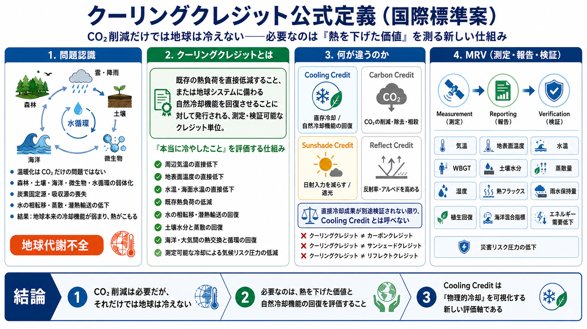

# クーリングクレジット公式定義（国際標準案）

[English](README.md) | [日本語](README_ja.md) | [العربية](README_ar.md)



[](https://ko-fi.com/M6J122N2K2)

---

## 小規模導入・地域実証への接続

この定義を、学校・商店街・公園・農地・避難所・バス停などの地域実証へ接続する入口として、以下の実装モデルを参照する。

- [Cooling-Credit-Local-Pilot-Model / クーリングクレジット小規模導入モデル](https://github.com/InchaComisho/Cooling-Credit-Local-Pilot-Model/blob/main/README_ja.md)

```text
公式定義 → 地域実証 → MRV測定 → 地域冷却ポイント → クーリングクレジット制度化
```

---

## 国際標準案としての定義・分類フレームワーク

**クーリングクレジット**とは、既存の熱負荷を直接低減すること、または地球システムに備わる自然冷却機能を回復させることに対して発行される、測定・検証可能なクレジット単位である。

この名称は、気温を直接下げる取り組み、または水の相転移、潜熱輸送、蒸散、土壌水分、海洋・大気熱交換などの自然冷却機能を補完・回復・再起動する取り組みに限定して用いるべきである。

本書は国際標準案としての定義文であり、既に採択された公的標準ではない。

---

## 1. 公式定義

クーリングクレジットは、次のいずれかを測定・報告・検証できる場合にのみ成立する。

1. 周辺気温の直接低下
2. 地表面温度の直接低下
3. 水温または海面水温の直接低下
4. 既存熱負荷の低減
5. 水の相転移と潜熱輸送の回復
6. 土壌水分と蒸散の回復
7. 海洋・大気間の熱交換と循環の回復
8. 測定可能な冷却による気候関連リスク圧力の低減

クーリングクレジットは、排出量会計、日射低減、アルベド上昇、見た目だけの緑化ではなく、物理的冷却、または自然の熱輸送機能の回復に基づかなければならない。

---

## 2. 地球代謝不全としての温暖化診断

温暖化とは、CO₂排出だけの問題ではなく、地球の代謝不全として捉える必要がある。

地球は本来、森林、土壌、海洋、微生物、植生、蒸散、雲、降雨、海流、炭素固定、炭素吸収、水の相転移によって熱を調整している。

しかし、人類は森林を減らし、土壌を壊し、海を弱らせ、水循環と水の相転移を失わせ、炭素固定源・炭素吸収源・自然冷却機能を弱体化させてきた。

その結果、地球は本来の冷却機能を失い、熱を逃がしにくくなった。CO₂排出はその熱のこもりをさらに強める。

したがってCO₂は原因の一部であると同時に、地球代謝崩壊の結果として増幅される症状でもある。

温暖化をCO₂排出だけの問題と診断するのは不完全である。人間で言えば、風邪や感染症で熱が出て呼吸が荒くなっている状態に対し、「呼吸でCO₂が多く出ている。だから呼吸を減らしましょう」と言っているようなものである。

呼吸を整えることは必要かもしれない。しかし、それだけでは発熱の原因は治らない。必要なのは、免疫、血流、発汗、代謝、体温調節機能そのものを回復させることである。

地球でも同じである。必要なのは、森林、土壌、海洋、微生物、炭素固定、炭素吸収、水循環、保水、蒸散、水の相転移、潜熱輸送、自然冷却機能を回復させることである。

CO₂排出削減は必要である。しかし、それは治療の一部であって、地球の代謝そのものを回復する処置ではない。

---

## 3. 基本原則

クーリングクレジットが問うのは、次である。

```text
どれだけ熱負荷、温度ストレス、水循環の乱れ、土壌水分の喪失、自然冷却機能の低下を物理的に減らしたか。
```

カーボンクレジットが問うのは、次である。

```text
どれだけCO₂を削減・除去・相殺したか。
```

この二つは別分類である。

---

## 4. 名称保護条項

**クーリングクレジット**という名称は、気温を直接下げる、既存熱負荷を下げる、または自然冷却機能を回復するプロジェクトに限定すべきである。

**冷却・遮光・日陰・反射・アルベド・熱入力抑制**の詳細な境界については、[冷却名称境界定義](docs/COOLING_NAMING_BOUNDARY_ja.md) を参照する。
